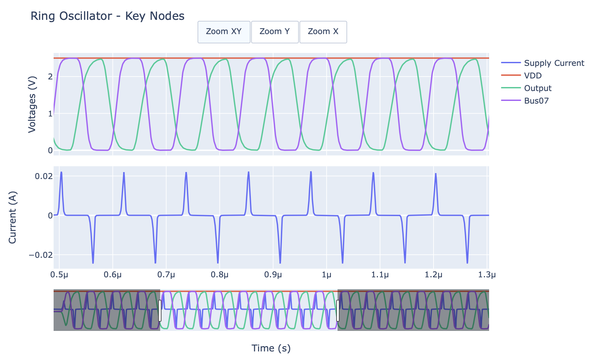

# Wave View

[](https://opensource.org/licenses/MIT)
[](https://www.python.org/downloads/)

A Python package for visualizing SPICE simulation waveforms with interactive Plotly-based plotting, designed for seamless integration with Jupyter notebooks.



## ✨ Features

- 📊 **Interactive Plotly Visualization**: Modern, web-based plots with zoom, pan, and hover
- 🔧 **Simple API**: Plot waveforms with a single function call
- 🖥️ **Command Line Interface**: Quick plotting from terminal with `wave_view plot`
- ⚙️ **YAML Configuration**: Flexible, reusable plotting configurations
- 🔤 **Case-Insensitive Signal Access**: Access signals regardless of case (`V(VDD)` = `v(vdd)`)
- 🧮 **Processed Signals**: Generate derived signals with lambda functions
- 📓 **Jupyter-First Design**: Auto-detection and inline plotting
- 🎛️ **Advanced Plotting**: Full control with `SpicePlotter` class
- 📋 **Template Generation**: Auto-create configurations from SPICE files

## 🚀 Quick Start

### Installation

#### Option 1: Install from PyPI (Coming Soon)
```bash
pip install wave_view
```

#### Option 2: Install from GitHub (Latest)
```bash
# Install latest version directly from GitHub
pip install git+https://github.com/jianxun/wave_view.git

# Or install a specific branch/tag
pip install git+https://github.com/jianxun/wave_view.git@main
pip install git+https://github.com/jianxun/wave_view.git@v0.1.0
```

#### Option 3: Development Installation
```bash
# Clone the repository
git clone https://github.com/jianxun/wave_view.git
cd wave_view

# Create and activate virtual environment (recommended)
python -m venv venv
source venv/bin/activate  # On Windows: venv\Scripts\activate

# Install in development mode (editable install)
pip install -e .

# Install development dependencies (optional)
pip install -r requirements-dev.txt
```

#### Verify Installation
```bash
python -c "import wave_view as wv; print(f'Wave View {wv.__version__} installed successfully!')"
```

### Basic Usage

```python
import wave_view as wv

# 1️⃣ Build a PlotSpec (YAML file, YAML string, or dict)
spec = wv.PlotSpec.from_yaml("""
title: "Voltage Analysis"
x: "time"
y:
  - label: "Voltage (V)"
    signals:
      VDD: "v(vdd)"
      OUT: "v(out)"
      IN:  "v(in)"
""")

# 2️⃣ Quick plot – let plot() load the file lazily
fig = wv.plot("simulation.raw", spec)
fig.show()
```

### Command Line Interface

Wave View includes a powerful CLI for quick plotting without writing Python code:

```bash
# Plot with specification file
wave_view plot simulation.raw --spec config.yaml

# Plot with custom options
wave_view plot simulation.raw --spec config.yaml --title "My Analysis" --theme plotly_dark

# Save to file
wave_view plot simulation.raw --spec config.yaml --output plot.html

# List available signals
wave_view signals simulation.raw
wave_view signals simulation.raw --limit 20

# Get help
wave_view --help
wave_view plot --help
```

### Advanced Usage

```python
import numpy as np, wave_view as wv

# Pre-load data for inspection or heavy processing
data, _ = wv.load_spice_raw("simulation.raw")
print(f"Signals → {list(data)[:10]}")

# Create a derived signal
power = data["v(out)"] * data["i(out)"]

spec = wv.PlotSpec.from_yaml("""
x: "time"
y:
  - label: "Voltage & Power"
    signals:
      OUT:   "v(out)"
      Power: "power"
""")

fig = wv.plot(data, spec, processed_data={"power": power})
fig.show()
```

### Configuration Validation

PlotSpec uses Pydantic, so validation happens automatically when you call ``PlotSpec.from_yaml`` or ``PlotSpec.model_validate``.  Invalid specs raise ``ValidationError`` with helpful messages.

## 📖 Documentation

### Configuration Format

Wave View uses YAML configuration files for flexible plotting:

```yaml
title: "Voltage Analysis"
X:
  signal_key: "time"
  label: "Time (s)"
Y:
  - label: "Supply Voltages (V)"
    signals:
      VDD: "v(vdd)"
      VSS: "v(vss)"
  - label: "Signal Voltages (V)"
    signals:
      OUT: "v(vout)"
      IN: "v(vin)"
```

### Configuration Validation

Validate your configurations before plotting:

```python
# Validate configuration
config = wv.config_from_yaml("""
title: "My Plot"
X:
  signal_key: "time"
Y:
  - signals:
      OUT: "v(out)"
""")
warnings = wv.validate_config(config)
if warnings:
    print("Warnings:", warnings)
```

### Jupyter Integration

Wave View automatically detects Jupyter environments and displays plots inline:

```python
# In Jupyter notebook - displays automatically
wv.plot("simulation.raw")

# Manual renderer control
wv.set_renderer("notebook")  # or "browser", "png", etc.
```

## 📁 Examples

The `examples/` directory contains:

- **`examples/scripts/`**: Python script examples
- **`examples/notebooks/`**: Jupyter notebook tutorials  
- **`examples/data/`**: Sample SPICE files for testing

## 🛠️ Development

### Setup Development Environment

```bash
# Clone the repository
git clone https://github.com/your-username/wave_view.git
cd wave_view

# Create and activate virtual environment
python -m venv venv
source venv/bin/activate  # On Windows: venv\Scripts\activate

# Install in development mode with all dependencies
pip install -e .
pip install -r requirements-dev.txt

# Verify development setup
python -c "import wave_view as wv; print('Development setup complete!')"
```

### Run Tests

```bash
# Run all tests
pytest

# With coverage
pytest --cov=wave_view --cov-report=html

# Run specific test file
pytest tests/test_basic.py -v
```

### Code Quality

```bash
# Format code
black src/ tests/

# Sort imports
isort src/ tests/

# Lint code
flake8 src/ tests/

# Type checking
mypy src/
```

## 🏗️ Project Structure

```
wave_view/
├── src/wave_view/
│   ├── core/
│   │   ├── plotspec.py      # PlotSpec model
│   │   ├── plotting.py      # Plotting helpers + plot()
│   │   └── wavedataset.py   # WaveDataset + low-level loaders
│   ├── loader.py            # load_spice_raw convenience wrapper
│   ├── cli.py               # Command-line interface
│   └── __init__.py          # Public symbols (plot, PlotSpec, load_spice_raw,...)
├── tests/                   # Test suite
├── examples/                # Usage examples
├── docs/                    # Documentation
└── pyproject.toml           # Packaging
```

## 📋 Requirements

- **Python**: 3.8+
- **Core Dependencies**:
  - `plotly` >= 5.0.0 (Interactive plotting)
  - `numpy` >= 1.20.0 (Numerical operations)
  - `PyYAML` >= 6.0 (Configuration files)
  - `spicelib` >= 1.0.0 (SPICE file reading)
  - `click` >= 8.0.0 (Command line interface)

## 🤝 Contributing

Contributions are welcome! Please:

1. Fork the repository
2. Create a feature branch (`git checkout -b feature/amazing-feature`)
3. Make your changes
4. Add tests for new functionality
5. Ensure all tests pass (`pytest`)
6. Commit your changes (`git commit -m 'Add amazing feature'`)
7. Push to the branch (`git push origin feature/amazing-feature`)
8. Open a Pull Request

## 📜 License

This project is licensed under the MIT License - see the [LICENSE](LICENSE) file for details.

## 📚 Documentation

Comprehensive documentation is available with:

- **User Guides**: Installation, quickstart, and configuration
- **API Reference**: Complete function documentation
- **Examples**: Practical use cases and tutorials
- **Development**: Contributing guidelines and setup

### Build Documentation Locally

```bash
# Install documentation dependencies
pip install -e ".[docs]"

# Build documentation
make docs

# Serve documentation locally
make docs-serve  # Opens at http://localhost:8000
```

## 🔗 Links

- **Documentation**: [Local Build Available]
- **PyPI Package**: [Coming Soon]  
- **Issue Tracker**: [GitHub Issues](https://github.com/your-username/wave_view/issues)
- **Changelog**: [CHANGELOG.md](CHANGELOG.md)

## 🏷️ Version

Current version: **0.1.0** (Alpha)

---

**Wave View** - Making SPICE waveform visualization simple and interactive! 🌊📈 
